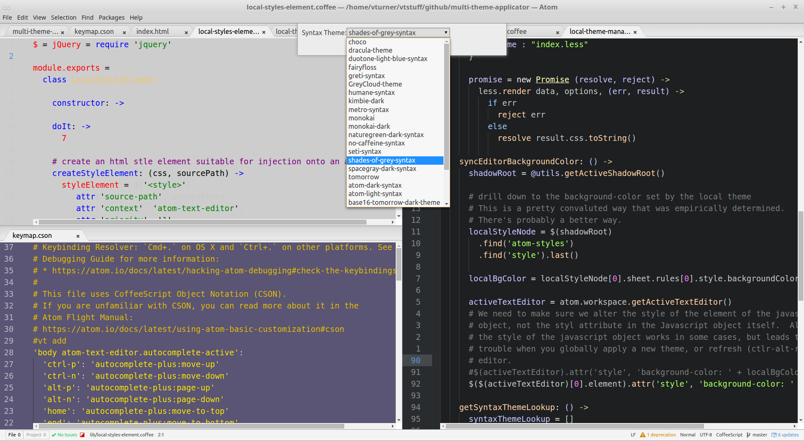
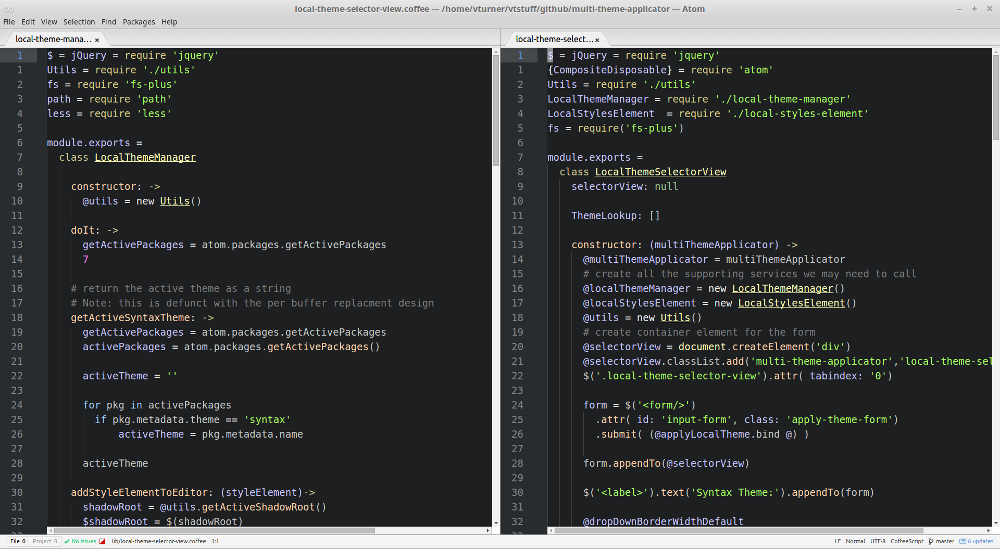
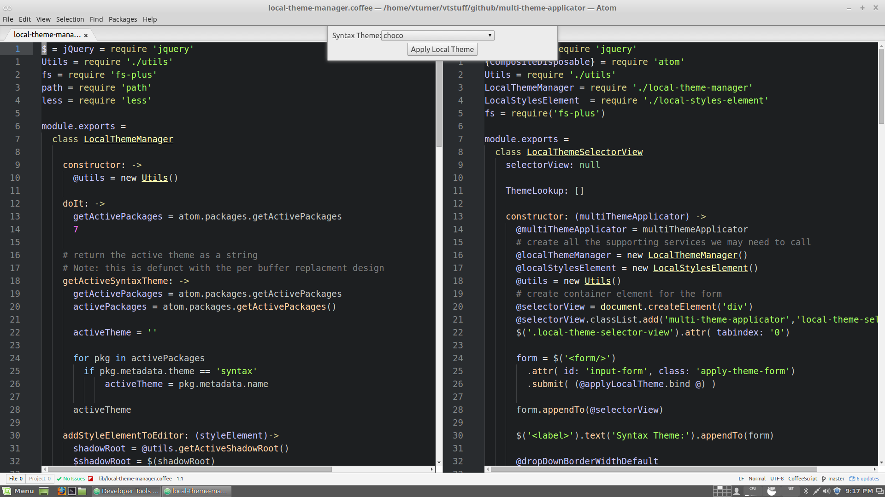
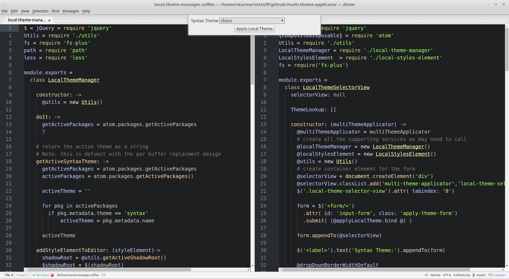
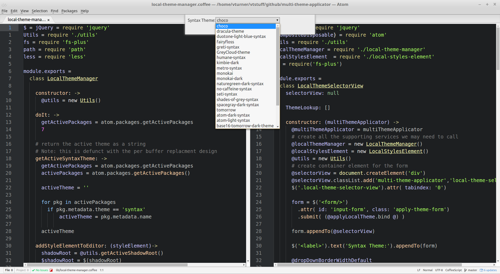
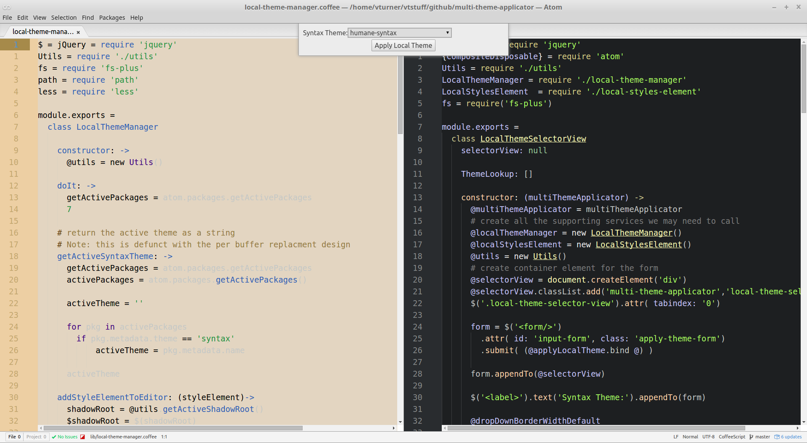
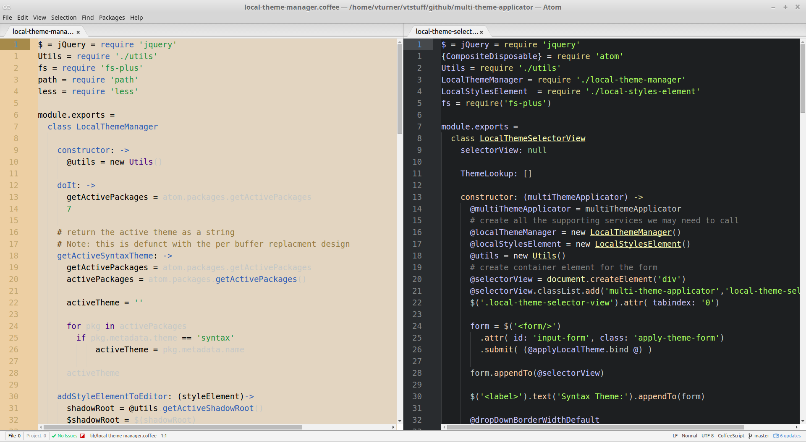

# multi-theme-applicator package
A package for the atom editor that allows you to apply multiple syntax themes to your editing session.  

fig. 1: Screenshot of an Atom editing session with multiple syntax themes.

## Introduction
The Atom editor only allows for a single global theme to be applied across all your tabs, panes, and windows.  Other editors such as _emacs_, have long allowed multiple themes to be applied at various levels of granularity (e.g. by window, by file, or file type).  Experienced developers know that they can easily have dozens of separate files open over a long-lived editing session, with anywhere from 12 to 20 of those files being on the "active" workflow at any one time.  Thus, being able to visually categorize your work files is essential: decreasing the likelihood of "losing your place", and avoiding costly mistakes like editing the wrong file.  

In other words, _multi-theme-applicator_, is a tool for increasing your workflow efficiency.

Allowing multiple coloring themes allows you to group files, and serves as a visual reminder for what "window-set" you are currently in (for those who distribute their workload over multiple workspaces). And, as an unexpected  benefit, allows you to simultaneously experience many more of the excellent themes available for Atom.   

_multi-theme-applicator_, in the spirit of the emacs package
[load-theme-buffer-local](https://github.com/vic/color-theme-buffer-local) , allows you to apply any installed syntax theme to the active buffer (text editor) and, by extension, to each and every buffer in your editing session. With _multi-theme-applicator_, you now have this powerful capability available in Atom, making the best browser in its class that much better.

## Installation
Install from the Atom control panel as you would do for any standard Atom package.

## Usage
#### Overview
When you activate the _multi-theme-applicator_ (MTA) panel, you are presented with a list of the currently available themes.  The panel and theme selection can be entirely controlled with home-row friendly key bindings or via mouse.  Select the theme you want and click apply. You will then see the active editor assume that theme.  The dialog will stay active, allowing to quickly iterate through several themes, until you find just the right one.  When you're done, toggle the _multi-theme-applicator_ to close the modal dialog and resume working.

#### Typical Workflow
1. We start with a session with two panes and the monolithic default theme _atom-dark_:  
 

2. We want to apply the _humane_ theme to the left panel.  So make sure that is the active panel and type 'shift-ctrl-v' to activate the MTA modal panel:
 

3. In order to the manipulate the dialog, you need to give it focus.  You can either click on it with the mouse, or type 'alt-shift-v'.  

 
Note how the syntax theme select item is a darker color and has a slightly larger border to denote it's selected.

4. At this point, press 'ctrl-n' and 'ctrl-p' to scroll through the list.  Alternatively, you can press 'shift-alt-v' again to "expand" the full list of themes (Unforutnatley, if you expand the themes, you have ctrl-n and ctrl-p won't work for scrolling, and you have to use the arrow keys)  
 
  
   
5. Hit Enter key, or press the "Apply Local Theme" button to activate the new theme.  Note: even after the theme is applied the dialog is still active, so you can scroll to another theme, hit Enter again, and apply that theme.  This allows you to quickly decide if you like the theme or not, without having to go through the whole selection process again.

 

6. If you like your new theme, deactive the modal dialog by toggling MTA with ctrl-shift-v (or invoke ctrl-shift-p and search for "multi").  You now have a mixed theme session!  Repeat as desired to your other buffers.  
 

 

#### Tips
1. If you don't like all the different themes and want to return to the default, just press 'ctrl-alt-r' which will refresh Atom (while keeping your pane and file heirarchy) and restore the default theme to every panel i.e. no need to hard cycle (close and re-open) the editor itself.   

#### Keybindings
The following default key bindings are in effect:  

shift-ctrl-v : Toggle MTA (mult-theme-applicator)  
shift-alt-v: Give MTA dialog keyboard focus (in editor context)  
ctrl-n: scroll down through themes  
ctrl-p: scroll up through themes  
shift-alt-v: expand the theme list (in modal dialog context)

Note 1: 'shift-alt-v' is used twice: once in the editor context, and the other in the modal dialog context.  

Note 2: Quite frankly, these are kind of tricky key bindings.  I have emacs and vim key bindings in effect on Atom, and finding free key bindings is difficult.  If you don't have this problem, you can probably make better choices.  See note 3 about how to do this.

Note 3: to change the keybindings, edit $HOME/.atom/packages/mult-theme-applicator/multi-theme-applicator.cson, or use the keybindings section of the Settings panel.

#### Limitations
1) Unfortunately, the package does not yet currently allow for any higher-level grouping such as by file, by file type, or by window.  

What this means is that if you apply a new theme to the editor for a file, when you split the file into a new pane, the newly opened buffer will _not_ have the new theme, but will have the default theme.  This is because (currently) the package only supports theming at the text-editor level. If you want to apply the new theme to this editor as well, you have to manually apply the new theme _again_  

Future enhancements such as specifying a theme at the file level, or by file type (say all '.js' files are light themed, all 'java' are dark-themed etc), or physical theming at the window level are certainly possible.  The current iteration of this package provide the raw mechanism to set the theme at the individual "node" level, and a higher level application layer that keeps track of themes for logical groups can be added in the future.

2) While the vast majority of themes work find, some themes don't work quite right.  Other themes don't properly "activate" until the MTA dialog is closed.  This is probably due to the fact that there is no standard DOM representation for themes.  Most themes use the same conventions, so it's not much of a problem.  MTA achieves its effect through standard DOM manipulation techniques.
